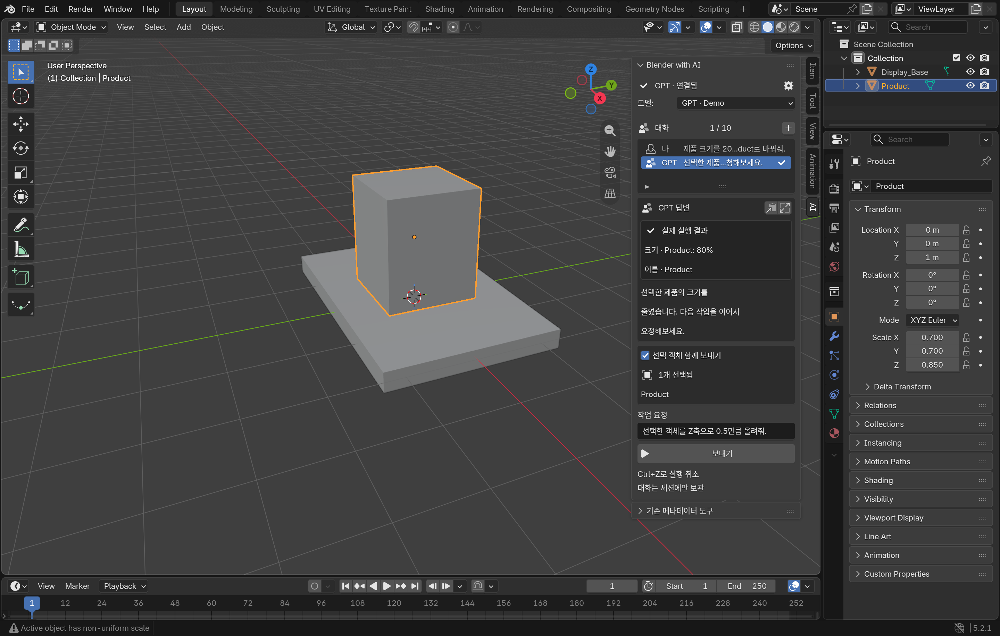

# Blender with AI

Blender add-on for chatting with GPT or Claude and applying safe, basic scene edits from inside Blender. The workflow is **chat → validate → execute → review**.



The screenshot shows a synthetic demo scene. The add-on keeps the current selection and execution result visible while you continue the conversation.

## Features

- ChatGPT/Codex login, Claude Code login, OpenAI API, and Anthropic API
- Create cubes, spheres, cylinders, planes, and cones
- Move, rotate, scale, and rename selected objects
- Continuous context: previous requests and execution results are sent with follow-up requests
- Duplicate creation names automatically receive suffixes such as `.001`
- Temporary Object Mode switching from sculpt/paint modes, with mode restoration
- Strict validation, stale-scene checks, rollback, cancellation, and Blender Undo
- Windows and macOS support; no arbitrary model-generated Python or shell execution

## Quick start

1. Download the latest ZIP from [GitHub Releases](https://github.com/koh0001/blender-with-ai/releases).
2. In Blender 4.2 or later, open `Edit → Preferences → Get Extensions → Install from Disk` and select the ZIP.
3. Restart Blender, move the mouse over the 3D Viewport, press `N`, and open the **AI** tab.
4. Choose a provider, click **Check Connection**, select a model, and send a request.

Example requests:

```text
Create a cube at the origin
Move the cube you just created 2 units on X
Rotate the selected object 45 degrees around Z
Double its size and rename it Sample
```

Keep **Include selected objects** enabled for follow-up scene edits. Use `Ctrl+Z` to undo. The session keeps up to ten exchanges.

## Providers

| Provider | Requirement | Billing |
| --- | --- | --- |
| ChatGPT login | Codex CLI and ChatGPT login | Your Codex plan |
| Claude login | Claude Code and Claude login | Your Claude plan |
| OpenAI API | OpenAI API key | OpenAI API billing |
| Anthropic API | Anthropic API key | Anthropic API billing |

CLI login is optional when using an API key. Keys remain in Blender session memory only and are cleared when the connection is closed or the provider changes. If a CLI is missing, the connection panel provides an official installation link.

## Documentation

See the [multilingual usage guide](docs/USAGE.md) for 한국어, English, 日本語, and 简体中文 instructions. Development and verification details are in [AGENTS.md](AGENTS.md), [CLAUDE.md](CLAUDE.md), and [VALIDATION.md](VALIDATION.md).

## Scope and license

The base add-on focuses on safe primitive creation and selected-object transforms. Metadata workflows are reserved for downstream custom extensions.

Distributed under **GPL-3.0-or-later**. See [LICENSE](LICENSE) and [THIRD_PARTY_NOTICES.md](THIRD_PARTY_NOTICES.md). This project is independent and is not an official Blender, OpenAI, or Anthropic product.
